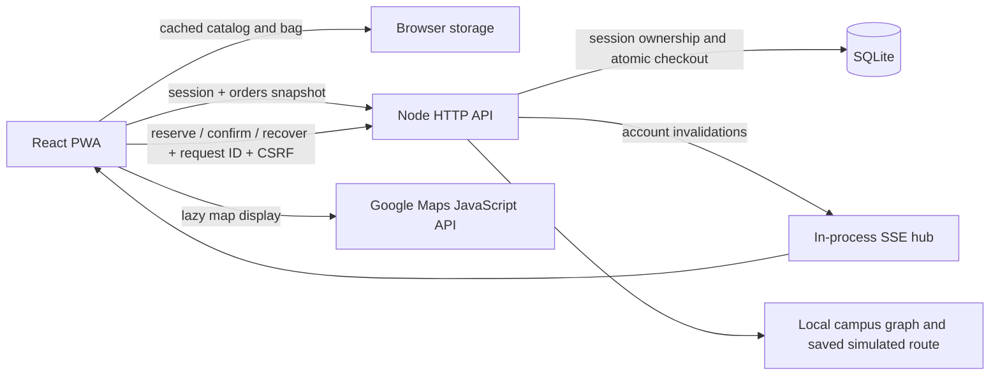

# Performance and production review

Reviewed September 28, 2026, starting from `a5380d1`. This review traces the running Node deployment and its React client, rather than treating the alternate Worker bundle as the production backend.

**The app is a demo, not yet a system for thousands of concurrent students.** Its strongest production blocker is local, ephemeral SQLite. The changes in this review fix reproduced correctness bugs and repeated work; they do not replace storage, authentication, or simulated delivery with production integrations.

## Request flow and existing protections



- **Startup:** `useCampusStore.readSession` requests `/api/session?include=orders`; the server authenticates a cookie, reads the wallet ledger, and returns at most 50 orders in the same response. `useInventory` renders cached/sample products before `/api/catalog` returns. No external Google request blocks server checkout.
- **Checkout:** `createDemoOrder` validates origin, CSRF, cart, destination and ownership, computes a local pickup route, then inserts an account-scoped idempotent queue entry. `settleTicks` processes the database queue in FIFO order. `confirmHold` converts a five-minute reservation into an order and allocation in one transaction. The browser recovers uncertain replies using the same request ID.
- **Consistency:** `local-db.batch` uses `BEGIN IMMEDIATE`; uniqueness constraints, account cooldown triggers, and stock/funds checks execute inside the transaction. Tests cover the last item, concurrent confirmations, different sessions for one account, stale queue readers, lost replies, and rollback. These are useful protections to port, not replace with an in-memory lock.
- **Updates:** `/api/events` sends account invalidations, followed by a fresh snapshot. The hub schedules simulated pickup/delivery events in memory; there is no durable dispatcher, payment processor, school SSO, or POS integration. Non-demo integration mode fails closed.
- **Frontend:** maps and native transport already load lazily, route geometry is separate from animation ticks, closed historical maps unmount, and the storefront is memoized. Session refreshes already coalesce and preserve invalidations. No broad component or framework rewrite was justified.

## Findings and changes

Priority reflects risk for a real campus service. “Next” items remain unimplemented and must not be mistaken for deployment capabilities.

| Priority | Affected code/system | Evidence and consequence | Change or recommendation |
| --- | --- | --- | --- |
| Critical before real orders | `apps/api/src/local.mjs`, Cloud Run storage | The database is `.data/campus-demo.sqlite`, with no shared database or persistent volume. Container replacement loses state; separate replicas have independent inventory, accounts and orders. | **Next:** migrate to shared PostgreSQL, verify transactions and restore procedures before increasing API replicas. A one-instance limit does not guarantee one writer during every rollout or burst. |
| High | `orders/orders.mjs`: `createDemoOrder`, `publicOrder` | An identical retry returned 409 after a catalog price change. Changing the configured fee made an old receipt show subtotal 650 + fee 200 but total 750. | **Fixed:** fingerprint submitted IDs, quantities and confirmed coordinates; support saved legacy fingerprints; resolve existing requests before today's catalog. Derive receipt fee from its saved total and subtotal. Removed products remain replayable with their original key, but cannot start a new checkout. |
| High | `inventory/inventory.mjs`: `ensureInventory` | 100 catalog GETs attempted 100 inventory inserts, even when all products already existed. | **Fixed:** one shared successful initialization promise per database binding; failures clear it so the next request can retry. Reopening a connection still inserts only missing products and never replenishes sold stock. Stock reads remain authoritative database queries. |
| High at scale | `database/local-db.mjs`: `prepare`/`bind` | Each bound query prepared twice. 5,000 repeated reads caused 10,000 SQLite preparations. All SQLite work runs synchronously on the Node event loop. | **Fixed repeated work:** immutable binding wrappers and a 128-entry per-connection statement cache. **Next:** asynchronous PostgreSQL access; statement caching does not make SQLite asynchronous or remove its write serialization. |
| High | `app/useCampusStore.ts`, `features/storefront/useInventory.ts` | Focus, visibility, pageshow and tab events overlapped checkout reads. Hidden tabs fetched snapshots after order events and refreshed inventory every 15 minutes. | **Fixed:** coalesce recovery by checkout/account generation; defer hidden-tab network work while preserving local bag/hold sync; pause hidden catalog timers and consume newer shared snapshots before fetching on wake. Explicit invalidations still require a fresh server read. |
| High before real identities | `api.mjs` session bootstrap, `useCampusStore.failAction` | Two cookie-less session requests created two anonymous accounts; the last cookie could leave the first tab holding an old token. A request using that token correctly failed CSRF with 403. Previously that failure alone did not refresh credentials. | **Recovery fixed:** only coded CSRF mismatch clears stale account state and refreshes the session, preserving the checkout key and never replaying the POST automatically. **Remaining:** simultaneous initial requests can still create separate anonymous accounts. Verified school identity is needed for stable ownership; this recovery is not a complete bootstrap-race fix. |
| High before replicas | `orders/order-events.mjs`, `http/rate-limit.mjs` | The SSE hub and rate limits live in one process. Streams are capped at 32/process and four/account; every visible idle tab can request one. Cloud Run concurrency is 80. | **Next:** shared event delivery and distributed abuse controls. Measure stream occupancy and fallback polling. Cross-tab stream leadership or an idle-client policy can reduce demand, but must retain reconnect/snapshot correctness. |
| High before growing inventory | `inventoryRecords`, `stockFits`, wallet SUM queries | Query plans use `order_items_product`, `checkout_queue_status_expiry` and account indexes. However, stock sums historical allocations and scans held JSON per product; wallet reads sum the account's order history. | **Next:** normalized reservation lines and transactional stock/wallet balances in PostgreSQL, retaining an audit ledger. No demonstrated HTTP-level N+1 and no justification for duplicate indexes. The fixed demo inventory bounds current sales; historical-growth cost is not a measured production outage. |
| High before real dispatch | `settleTicks`, `order-events.mjs`, future integrations | Queue settlement is request-driven, and simulation timers disappear with the process. An HTTP retry cannot prove whether an external robot/payment side effect occurred. | **Next:** transactional outbox, durable workers and provider idempotency. Keep external calls outside stock transactions. Preserve DB-controlled allocation order; a task queue is not the checkout FIFO arbiter. |
| Medium | `http/http.mjs`: `readSmallJson` | Bodies were already limited to 8,192 streamed bytes, but a stalled stream could remain pending after a synthetic signal abort. | **Fixed:** ten-second whole-body deadline, explicit abort cancellation and cleanup. The API maps timeouts to 408; an incomplete Node upload may observe connection closure instead. Existing malformed/oversized requests remain 400. Long-lived SSE responses are unaffected. |
| Medium | `package.json`: `db:generate`, migration metadata | SQL history reaches `0011`, but Drizzle's journal/snapshots stop at `0002`. Generating on an isolated copy recreated existing objects; applying it failed with `table accounts already exists`. | **Guarded:** generation fails before writing when history and metadata disagree. Preserve existing migrations and use the documented append-only workflow in [DATABASE.md](DATABASE.md). Full metadata reconciliation remains work. |
| Medium | `.github/workflows/quality.yml` | Tracked workflows previously covered secrets/dependencies and deployment reporting, without a build-and-test job. | **Added:** build, tests and lint on Node 22 (Docker runtime family) and 24 for pushes/PRs. The existing independent Cloud Build trigger still deploys on push; this check is not yet a release gate. |
| Medium before real identities | `auth/auth.mjs`, session/order foreign keys | Cookies are server-issued, HttpOnly, Secure on HTTPS and SameSite=Lax; expiry is checked at seven days. Anonymous demo wallets can be recreated, and expired rows are retained. | **Next:** verified school identity, explicit revocation/logout and retention policy. Do not delete sessions blindly: historical orders and queued checkouts reference them. |
| Medium | `api.mjs` error handling, `local.mjs` shutdown | Errors expose no internals to clients, but internal logs usually contain only the error name. Shutdown closes streams but has no explicit bounded drain deadline/readiness endpoint. | **Next:** redacted request IDs, operation/error codes, DB and event-loop timings, readiness, and bounded shutdown. Never log cookies, CSRF, raw bodies or student coordinates. |

## Measured impact

The query probe uses Node 24.21.0 and disposable in-memory SQLite on the development machine. Timings include runtime noise and are not Cloud Run capacity estimates. Work counts are the reproducible result.

| Probe | Before | After |
| --- | ---: | ---: |
| SQLite preparations for 5,000 identical bound reads | 10,000 | 1 |
| Seed attempts during 100 catalog API reads | 100 | 1 |
| SQLite preparations during those catalog reads | 400 | 2 |
| Concurrent checkout reads from overlapping wake events | 4 | 1 |
| Catalog requests during one hidden hour | 4 | 0 |
| Hidden order/session events | Immediate network reads | Deferred; one snapshot and catalog read on wake |
| Identical purchase retry after catalog edit | 409 conflict | 200, original order and prices |
| Saved receipt after configured fee changes | Inconsistent components | Original fee and total |

Run `node tooling/bench/request-work.mjs` to reproduce the database/API counts without hitting the live app or changing its database. In the initial probe, bound reads took 30.63 ms before and 6.83 ms after; catalog reads took 46.58 ms before and 36.46 ms after. These small local timings must not be extrapolated to thousands of concurrent requests.

The pre-change browser build's initial JavaScript was 83,451 bytes Brotli; the lazy map chunk was 22,376 bytes and initial CSS 9,071 bytes. The added coordination/recovery guards bring the entry to 83,780 bytes, a 329-byte tradeoff for fewer requests and safer recovery. This did not justify replacing the UI library. A 162 KB seal displayed at 64×64 remains an optional image-derivative improvement. Service-worker precaching after load can download lazy chunks without executing them; distinguish that traffic from initial JS parse time when profiling.

## Production architecture to build next

1. **Shared PostgreSQL first.** Port SQLite-specific JSON SQL, triggers, conflict handling and transaction behavior explicitly. Lock affected inventory rows in a stable product order, enforce one active checkout/account and unique account/request IDs, and keep reservation expiry/confirmation atomic. Use server time. Test the last-item race from separate processes before enabling more replicas. Preserve the ledger: deleting it currently changes stock and wallet calculations.
2. **Bounded connections.** There is currently no PostgreSQL driver or pool to tune. When added, use one pool per API process, acquisition/query/lock timeouts and guaranteed release. All statements in a transaction must use the same checked-out client. Budget `max concurrent API processes × pool maximum + worker/listener connections + rollout headroom` below the database's usable limit. Never hold a connection for an SSE stream. Choose pool and Cloud Run concurrency limits from load-test wait times, not from a generic large default. [Transactions](https://node-postgres.com/features/transactions), [Cloud SQL connection management](https://docs.cloud.google.com/sql/docs/postgres/manage-connections).
3. **Durable events and jobs.** Commit an outbox row with each order change. A worker publishes notifications and invokes future dispatch/payment adapters with stable deduplication keys, bounded retries and failed-task handling. Authenticate worker endpoints. Replace the current SQLite rowid notification watermark: a PostgreSQL sequence does not imply commit order. Cloud Tasks can execute tasks more than once and does not guarantee execution order, so consumer idempotency and database allocation remain necessary. [Cloud Tasks behavior](https://docs.cloud.google.com/tasks/docs/common-pitfalls).
4. **Shared event transport and abuse controls.** Publish account-scoped invalidations across replicas and retain snapshot-on-reconnect recovery. Test multiple visible tabs and transport fallback under stream saturation. Anonymous session creation currently has a global process allowance of 60 then one/second; one bot can crowd out legitimate newcomers. Introduce shared limits using verified identity/client-address boundaries plus edge protection, without rate-limiting recovery of accepted purchases as new purchases.
5. **Public caching without private-data leaks.** Hashed assets already have immutable caching, compression and ETags; other assets revalidate, and the local file cache is bounded at 8 MiB. Add a load balancer/CDN for public static paths and object storage for future uploads. Bypass private `/api/*` and SSE; do not force-cache responses containing wallet, session or order data. A later public catalog snapshot can use a bounded TTL/version, but checkout must recheck stock transactionally. [Cloud CDN with serverless backends](https://docs.cloud.google.com/cdn/docs/setting-up-cdn-with-serverless).
6. **Measure the deployed service.** At review time, the primary service used `europe-west1`, one CPU, 512 MiB, concurrency 80, request timeout 300 seconds, CPU throttling and a maximum of one instance. Measure client-to-region latency from Merced before selecting a US region. Monitor p50/p95/p99 response time, event-loop delay, pool waits, transaction lock time, reservation conflicts, stream occupancy, fallback request rate and queue lag. Put successful quality checks before production promotion.

Cloud Run's writable filesystem is temporary; minimum instances do not make it durable. Its maximum-instance setting can be briefly exceeded, including around rollout behavior, so it is not a substitute for database consistency. The current built-in custom-domain mapping is also a preview feature; evaluate a production load balancer when introducing the CDN. [Container contract](https://docs.cloud.google.com/run/docs/container-contract), [instance limits](https://docs.cloud.google.com/run/docs/configuring/max-instances), [domain mapping](https://docs.cloud.google.com/run/docs/mapping-custom-domains).

## Tradeoffs and verification

- Cached statements retain up to 128 entries per local connection; each request retains separate parameters. This adds bounded memory for less parsing.
- Successful inventory initialization is reused for the lifetime of a database binding. Deployment/reopening picks up catalog changes; a future live POS adapter needs its own explicit synchronization workflow.
- Hidden tabs can display their saved state until wake reconciliation completes. Local bag/hold changes still synchronize immediately; offline cache reads never invent a new successful API timestamp.
- A ten-second JSON upload limit can reject an unusually slow client, but the body is at most 8 KiB and retries retain their checkout key. The API maps a timeout to 408; cancelling an incomplete Node request can close its socket first, so clients must also handle a transport interruption.
- Migration generation intentionally stops while metadata is stale. Runtime SQL migration application remains unchanged.

Local regression commands:

```sh
npm run build
npm test
npm run lint
node tooling/bench/request-work.mjs
npm run native:sync
```

Tests cover atomic last-item allocation, account-scoped retry/authorization, catalog changes during retries, legacy hashes, fee snapshots, initialization failure/restart, bound-statement isolation and rollback, stalled/aborted JSON, hidden-tab traffic, offline freshness and recovery. Existing runtime smoke tests build a disposable runtime without `node_modules`; native sync is not a device build.

The review's local run passed **201 tests**, web/Worker builds and native synchronization on Node 24.21.0. Lint retained one existing `react(set-state-in-effect)` warning in `useCampusStore`; no new lint errors appeared. `npm audit` reported zero advisories, and the baseline Gitleaks scan found no leaks in 61 commits. These scanners do not prove the absence of every vulnerability.

The added IPC tests run two separate Node processes against one disposable SQLite file, covering both last-item competition and duplicate confirmation from separate sessions of the same account. A run observed a real `SQLITE_BUSY`/503 followed by unchanged-key recovery: one buyer succeeded and the other received `sold_out`; only one allocation and one charge existed. This extends the original same-event-loop `Promise.all` checks, but it does not simulate Cloud Run replicas with separate files or establish PostgreSQL behavior. SQLite currently has no busy-wait timeout; callers retain safe retry responsibility.

Before a production rollout, add staging tests with at least two API processes sharing PostgreSQL, simultaneous last-item purchases, browser reload after a lost confirmation, multiple tabs opening without a session, session expiry/revocation, reservation expiry racing confirmation, worker crashes after external success, duplicate task delivery, broker disconnects, database failover and backup restoration. Load-test realistic browsing/checkout/SSE mixes from separate clients and report latency/error/connection metrics; a passing unit suite or microbenchmark does not establish a student capacity figure.
